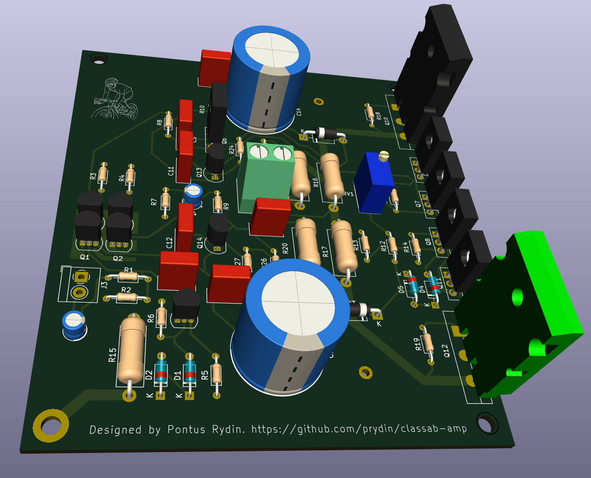
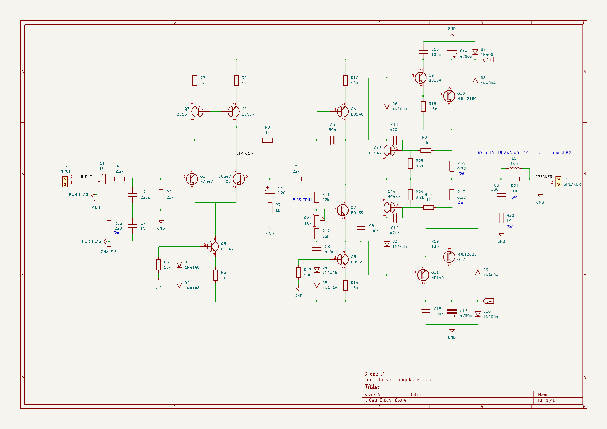
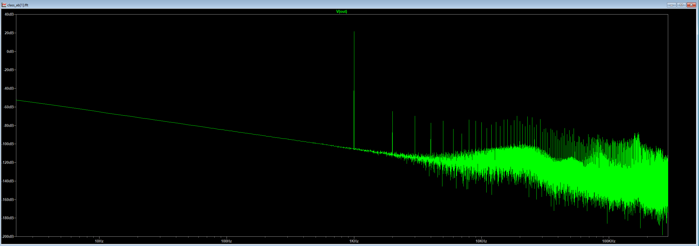
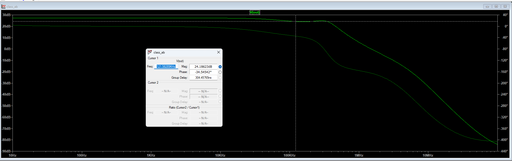

# 50W Class AB Amplififier



## Disclaimer
This amplifier has not yet been built and tested. It performs beautifully in SPICE, but has yet to be tested in real life. You are
welcome to use the design, but be aware that it may not perform well or work at all.

## Background
This is my take on a classic Class AB amplifier. I did it for two reasons: I wanted to learn how to design and build a Class AB amplifier and
I needed better sound than crappy Bluetooth speakers in my office. I settled for 50W because that's all the power I need for my application
and the voltages involved are a lot more forgiving than what you'd have with a 300W monster. 

Some people have said it looks a lot like Doug Self's "Blameless Amplifier". I take that as a compliment, but the fact is that I didn't even
know how Self was when I started building it. The design is just based on various ideas from other amplifiers that I put together and try to
make it my own.

## Overall design
The design is a simple single differential stage amplifier with a single transistor VAS driving two Darlington pairs for the final current 
gain stage. 

### Input stage
After the customary DC-blocking capacitor and RF filter, the signal is fed into a long tailed pair differential amplifier that's enhanced to 
an active current sink and current mirror loads. The active sink and load helps improve both distortion and frequency response. The bias 
current of the LTP is set to approximately 600uA. The LTP and its current mirrors are mounted on a separate copper island for maximum heat
condudctivity between the transistors. The feedback is fed through a 22k/1k voltage divider, yielding about 23x amplification. This is a 
conservative estimate and may have to be adjusted when testing the physical build.

### Voltage amplification/drive stage
I went for a very simple single-sided design here. I've gotten many suggestions that I should try a dual differential design instead, but 
the current design seems good enough, so I stuck with it. The VAS has a 47p compensation capacitor which appears to be enough to provide 
ample phase margin.

### Output stage biasing
The output stage is biased using a servo transistor driven by a constant current sink. The BD139 for the servo as chosen just because it's
easy to mount on a heat sink together with the power components for good heat conductivity between components. A much less powerful 
transistor works too, but would have been harder to attach to the heat sink.

### Output stage
Here I am using some very common components. BD139/BD140 transistors as the first stage of the Darlington pair and MJL3281/MLJ1302 for
the final stage. The final transistors can handle 200W, so they are definitely a bit overkill. However, they performed better than
TIP35/TIP36 in the simulator and headroom is never a bad thing to have. Before the signal reaches the speaker, it is passed through
a snubber and a Zobel network to further improve stability.

### Short circuit projection 
To protect against short circuits, overcurrent and catastrophic DC output, two transistors are fitted that measure the curremt across
the degeneration resistors and shut off the base current to the final Darlington stage when the current reaches approximately 4A. 

### Output coil
The output coil is realized simply by winding 10-12 turns of 16 AWG wire around R21. See the photo below!


### Power improvements
Altough this hasn't been tested or thorouhgly analyzed, it should be possible to increase the rail voltages to +-40V, which yields about
160W according to simultions. For this to work, the gain needs to be made higher by increasing the value of the feedback resistor. The
voltage divider for the short circuit protection also needs to be adjusted to allow more curent. Finally, the biasing may need to be adjusted
as well. 

# Schematic


## SPICE simulations

All simulations are done with an 8 ohm resistive dummy load, 1V input at 1kHz.

### THD
At a fairly moderate quiescent current of 15mA, I get a THD of 0.019%. A THD below 0.1% is considered to be inaudible, so these numbers
are fine by me. I know there are audiophiles who insist on THD numbers <0.0001%, but I'm not one of them. Inaudible is just fine by me.

I've gotten suggestions that adding an emitter follower to the VAS might improve THD. I might try that, but I have a feeling there will 
be more pressing matters than getting the THD even more inaudible. 

```Fourier components of V(out)
DC component:-0.00675533

Harmonic	Frequency	 Fourier 	Normalized	 Phase  	Normalized
 Number 	  [Hz]   	Component	 Component	[degree]	Phase [deg]
    1   	 1.000e+3	 2.087e+1	 1.000e+0	   90.66°	    0.00°
    2   	 2.000e+3	 1.490e-3	 7.140e-5	  -77.43°	 -168.10°
    3   	 3.000e+3	 3.155e-4	 1.512e-5	   38.31°	  -52.35°
    4   	 4.000e+3	 3.378e-4	 1.619e-5	  106.45°	   15.78°
    5   	 5.000e+3	 5.623e-4	 2.694e-5	 -129.10°	 -219.76°
    6   	 6.000e+3	 7.723e-5	 3.700e-6	  129.91°	   39.24°
    7   	 7.000e+3	 3.638e-4	 1.743e-5	 -163.17°	 -253.83°
    8   	 8.000e+3	 6.704e-5	 3.213e-6	 -144.07°	 -234.73°
    9   	 9.000e+3	 3.393e-4	 1.626e-5	 -174.70°	 -265.37°
   10   	 1.000e+4	 1.427e-4	 6.838e-6	 -141.03°	 -231.69°
Partial Harmonic Distortion: 0.008339%
Total Harmonic Distortion:   0.018652%
```



### AC Analysis
The amplifier has a 3dB bandwidth of about 72kHz, which is by no means in the audiophile range, but it keeps any poles far away from the audible 
range to make both the amplitude and phase response vritually flat where it matters. I am of the opinion that nothing >20kHz has any impact on
the listening experience.



